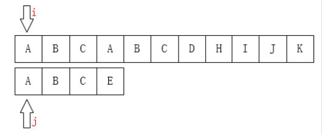
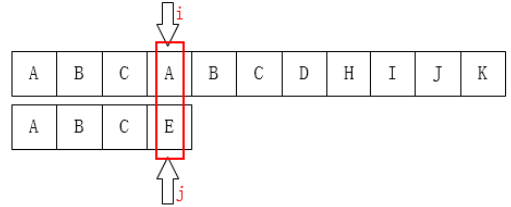
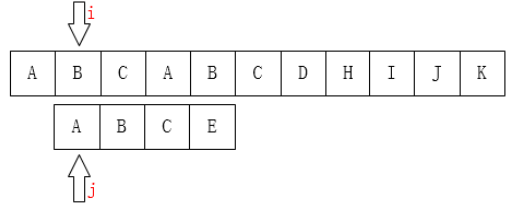
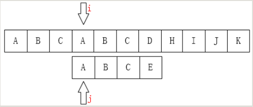

## KMP算法
KMP算法是三位大牛：D.E.Knuth、J.H.Morris和V.R.Pratt同时发现的。

KMP算法要解决的问题就是在字符串（也叫主串）中的模式（pattern）定位问题。
简单的说就是关键字的搜索

模式串就是关键字（接下来将称为P），
如果它在一个主串（接下来称之为T）中出现，就会返回它的位置，
否则返回-1

首先，对于这个问题有一个很单纯的想法：从左到右一个个匹配，如果这个过程中有某个字符不匹配，就跳回去，将模式串向右移动一位。这有什么难的？

我们可以这样初始化：

之后我们只需要比较i指针指向的字符和j指针指向的字符是否一致。如果一致就都向后移动，如果不一致，如下图：


A和E不相等，那就把i指针移回第1位（假设下标从0开始），j移动到模式串的第0位，然后又重新开始这个步骤：

如果是人为来寻找的话，肯定不会再把i移动回第1位，因为主串匹配失败的位置前面除了第一个A之外再也没有A了，我们为什么能知道主串前面只有一个A？因为我们已经知道前面三个字符都是匹配的！（这很重要）。移动过去肯定也是不匹配的！有一个想法，i可以不动，我们只需要移动j即可，如下图：


大牛们是无法忍受“暴力破解”这种低效的手段的，于是他们三个研究出了KMP算法。其思想就如同我们上边所看到的一样：“_利用已经部分匹配这个有效信息，保持i指针不回溯，通过修改j指针，让模式串尽量地移动到有效的位置_。”

所以，整个KMP的重点就在于当某一个字符与主串不匹配时，我们应该知道j指针要移动到哪？
### 提取加速匹配的信息
加速信息，即数组 next 的提取是整个 KMP 算法中最核心的部分，弄懂了 next 的求解方法，也就弄懂了 KMP 算法的十之七八了，但是不巧的是这部分代码恰恰是最不容易弄懂的…

```java
void Getnext(int next[],String t)
{
    int j=0,k=-1;
    next[0]=-1;
    while(j<t.length-1)
    {
        if(k == -1 || t[j] == t[k])
        {
            j++;k++;
            next[j] = k;
        }
        else k = next[k];//此语句是这段代码最反人类的地方，如果你一下子就能看懂，那么请允许我称呼你一声大神！
    }
}
```

直接移动模式串：将模式串中公共前后缀的前缀移动到后缀的位置

最长公共前后缀：如果模式串中有多个公共前后缀，取最长的公共前后缀作为判断标准

当发现模式串超出主串的长度，则输出失败
