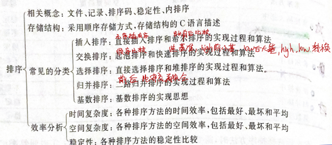
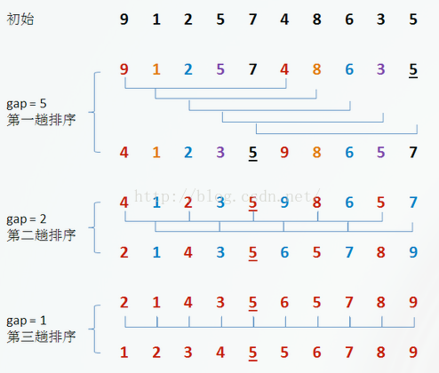

# 八大排序 -- 八大金刚
## 复杂度排序
常见的算法时间复杂度由小到大依次为

Ο(1)＜Ο(log2n)＜Ο(n)＜Ο(nlog2n)＜Ο(n2)＜Ο(n3)＜…＜Ο(2n)＜Ο(n!)

### 常见复杂度排序列表

不稳定：快选堆希

平均nlog2n：一堆海龟快活（快速、归并、堆）

平均n^2：冒险选择插入（冒泡、选择、插入）

特殊：希尔拿桶计基数（希尔1.3、桶、基数、计数）

## 选择排序 SelectionSort 
[Selection.java](./SelectionSort.java)

### 基本思想
给定数组：int[] arr={里面n个数据}；第1趟排序，在待排序数据arr[1]~arr[n]中选出最小的数据，将它与arrr[1]交换；第2趟，在待排序数据arr[2]~arr[n]中选出最小的数据，将它与r[2]交换；以此类推，第i趟在待排序数据arr[i]~arr[n]中选出最小的数据，将它与r[i]交换，直到全部排序完成。
### 算法描述
每一趟从待排序的记录中选出最小的元素，顺序放在已排好序的序列最后，直到全部记录排序完毕。也就是：每一趟在n-i+1(i=1，2，…n-1)个记录中选取关键字最小的记录作为有序序列中第i个记录。基于此思想的算法主要有简单选择排序、树型选择排序和堆排序。（这里只介绍常用的简单选择排序）

## 直接插入排序 Straight Insertion Sort
[StraightInsertionSort.java](./StraightInsertionSort.java)
### 使用情况
样本小且基本有序的时候效率比较高
### 基本思想
通常人们整理桥牌的方法是一张一张的来，将每一张牌插入到其他已经有序的牌中的适当位置。在计算机的实现中，为了要给插入的元素腾出空间，我们需要将其余所有元素在插入之前都向右移动一位。
### 算法描述
一般来说，插入排序都采用in-place在数组上实现。具体算法描述如下：

1. 从第一个元素开始，该元素可以认为已经被排序
2. 取出下一个元素，在已经排序的元素序列中从后向前扫描
3. 如果该元素（已排序）大于新元素，将该元素移到下一位置
4. 重复步骤3，直到找到已排序的元素小于或者等于新元素的位置
5. 将新元素插入到该位置后
6. 重复步骤2~5

## 冒泡排序 BubbleSort
### 基本思想
冒泡排序（Bubble Sort）是一种简单的排序算法。它重复地走访过要排序的数列，一次比较两个元素，如果他们的顺序错误就把他们交换过来。走访数列的工作是重复地进行直到没有再需要交换，也就是说该数列已经排序完成。这个算法的名字由来是因为越小的元素会经由交换慢慢“浮”到数列的顶端
### 算法描述
冒泡排序算法的运作如下：
1. 比较相邻的元素。如果第一个比第二个大，就交换他们两个。
2. 对每一对相邻元素作同样的工作，从开始第一对到结尾的最后一对。这步做完后，最后的元素会是最大的数。
3. 针对所有的元素重复以上的步骤，除了最后一个。
4. 持续每次对越来越少的元素重复上面的步骤，直到没有任何一对数字需要比较。

## 希尔排序 ShellSort
### 基本思想
希尔排序，也称 递减增量排序算法，是插入排序的一种更高效的改进版本。希尔排序是 非稳定排序算法。

希尔排序是基于插入排序的以下两点性质而提出改进方法的：

插入排序在对几乎已经排好序的数据操作时，效率高，即可以达到线性排序的效率
但插入排序一般来说是低效的，因为插入排序每次只能将数据移动一次

希尔排序是先将整个待排序的记录序列分割成为若干子序列分别进行直接插入排序，待整个序列中的记录“基本有序”时，再对全体记录进行依次直接插入排序。
### 算法描述

1. 选择一个增量序列 t1，t2，……，tk，其中 ti > tj, tk = 1；
2. 按增量序列个数 k，对序列进行 k 趟排序；
3. 每趟排序，根据对应的增量 ti，将待排序列分割成若干长度为 m 的子序列，分别对各子表进行直接插入排序。仅增量因子为 1 时，整个序列作为一个表来处理，表长度即为整个序列的长度。
