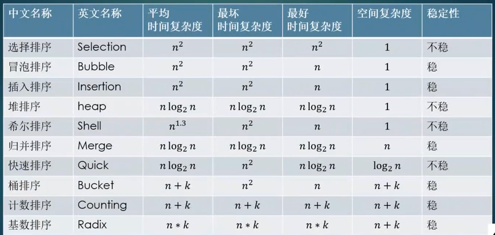
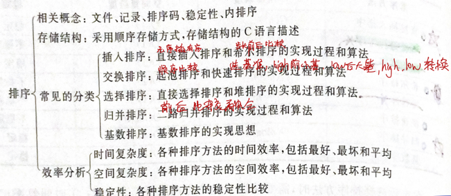

# 八大排序 -- 八大金刚
## 复杂度排序
常见的算法时间复杂度由小到大依次为

Ο(1)＜Ο(log2n)＜Ο(n)＜Ο(nlog2n)＜Ο(n2)＜Ο(n3)＜…＜Ο(2n)＜Ο(n!)

### 常见复杂度排序列表

不稳定：快选堆希

平均nlog2n：一堆海龟快活（快速、归并、堆）

平均n^2：冒险选择插入（冒泡、选择、插入）

特殊：希尔拿桶计基数（希尔1.3、桶、基数、计数）

## 选择排序 SelectionSort 
[Selection.java](./SelectionSort.java)

a) 原理：每一趟从待排序的记录中选出最小的元素，顺序放在已排好序的序列最后，直到全部记录排序完毕。也就是：每一趟在n-i+1(i=1，2，…n-1)个记录中选取关键字最小的记录作为有序序列中第i个记录。基于此思想的算法主要有简单选择排序、树型选择排序和堆排序。（这里只介绍常用的简单选择排序）

b) 简单选择排序的基本思想：给定数组：int[] arr={里面n个数据}；第1趟排序，在待排序数据arr[1]~arr[n]中选出最小的数据，将它与arrr[1]交换；第2趟，在待排序数据arr[2]~arr[n]中选出最小的数据，将它与r[2]交换；以此类推，第i趟在待排序数据arr[i]~arr[n]中选出最小的数据，将它与r[i]交换，直到全部排序完成。